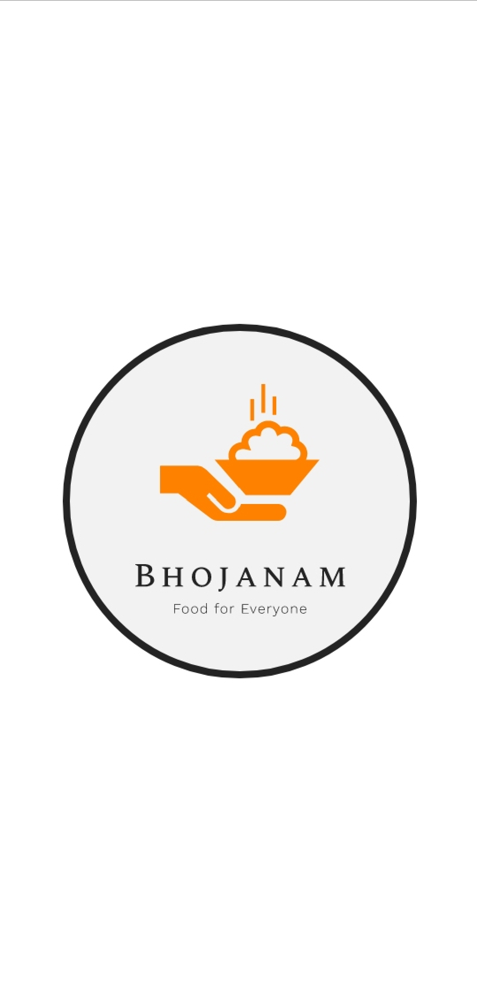
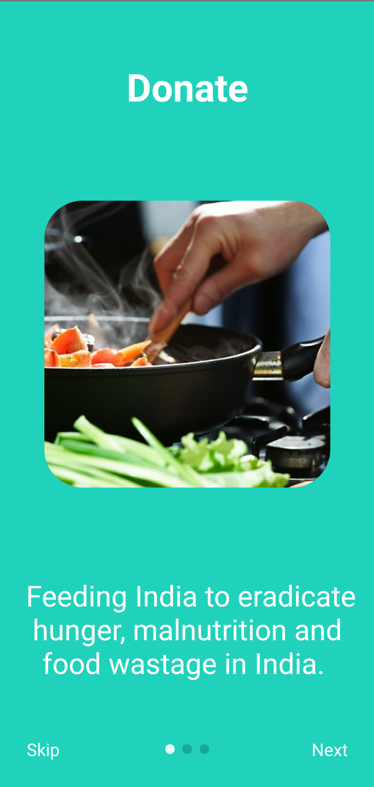
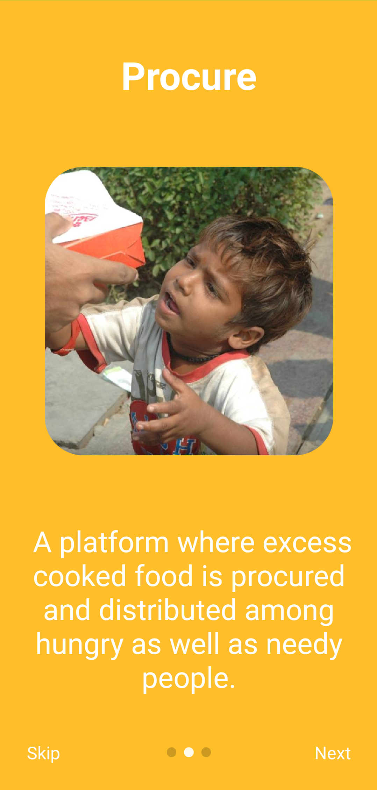
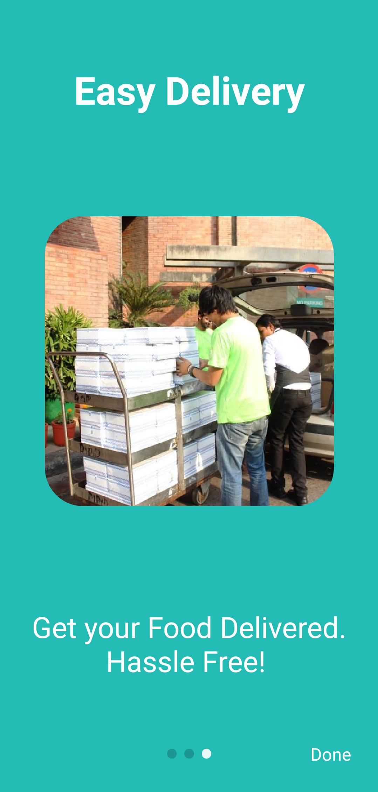
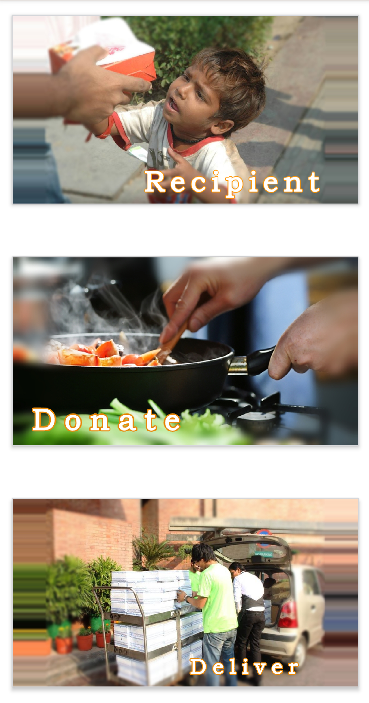
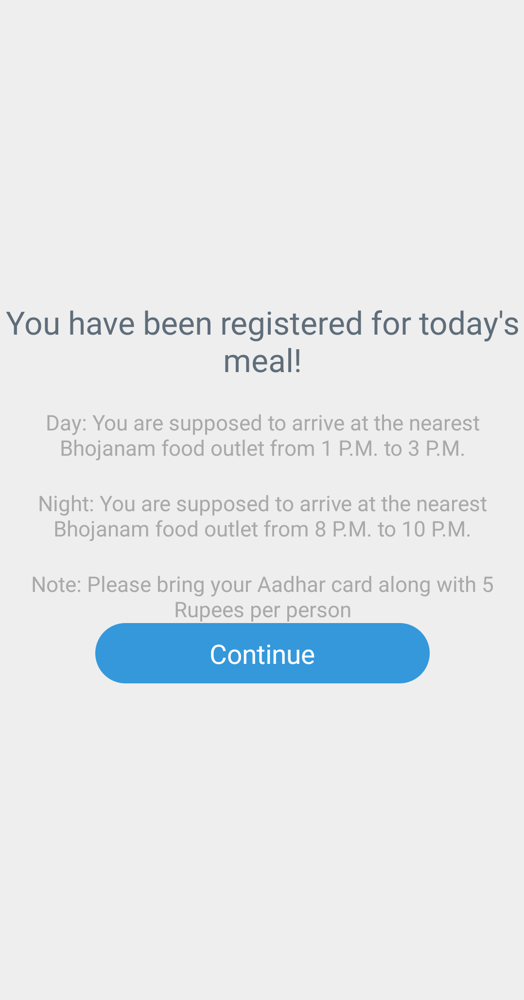
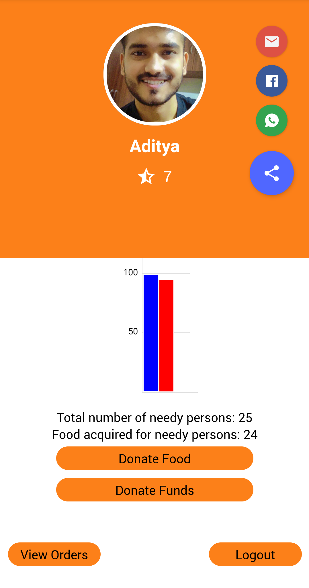
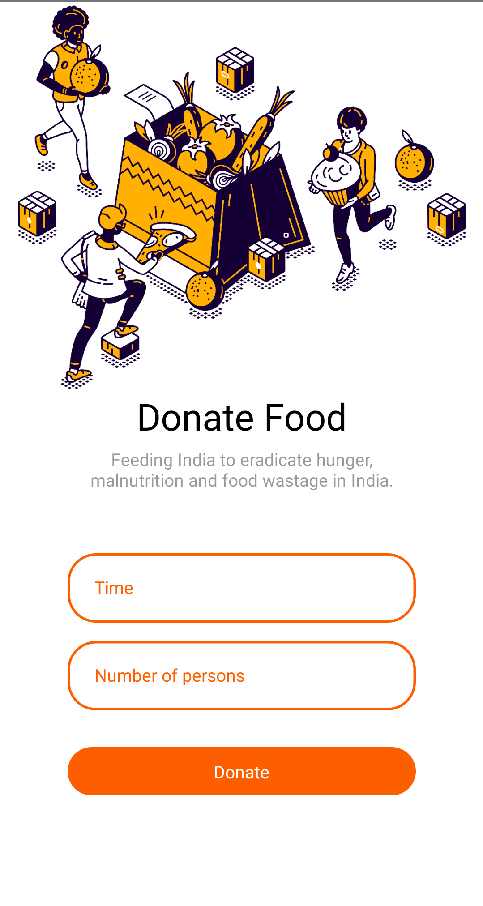
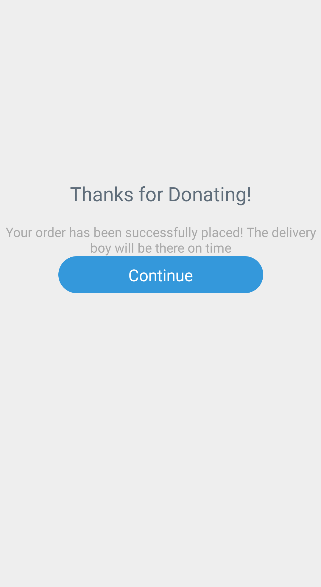
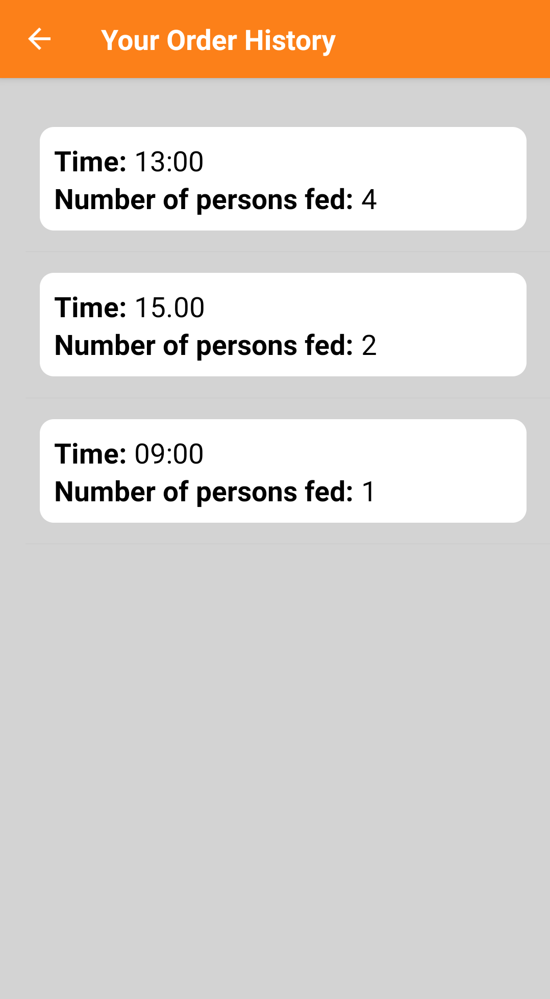

# Bhojanam
To feed the underfed, so that no Indian sleeps hungry.
Feeding India to eradicate hunger, malnutrition and food wastage in India.

## Play
Want to try it out?  [Play](https://black--jack.herokuapp.com/) 
## Description
A platform where the needy and hungry people are fed with the help of locals in the area so that each and every one gets food and dosent sleep hungry.

## How to set it up?
- Clone this repository.
- The 'bhojanam-backend' folder contains the backend code of the app.
- The 'Bhojanam' folder contains the react-native app

Open both the respective folders and

Using npm:

```bash
$ npm install
```

## How to start? 
Using npm:

```bash
$ npm start
```
# Screenshots
<p float="left">
  
   
  
  
</p>
<p float="left">
  
   
  
  
</p>
<p float="left">
  
   
  
  
</p>
## Technology Stack
- ReactNative
- Nodejs
- MongoDB
- Express
- Javascript

## References
- Stack Overflow
- React Native

## Future Updates
- Push Notifications
- Authorization using Social Platforms
